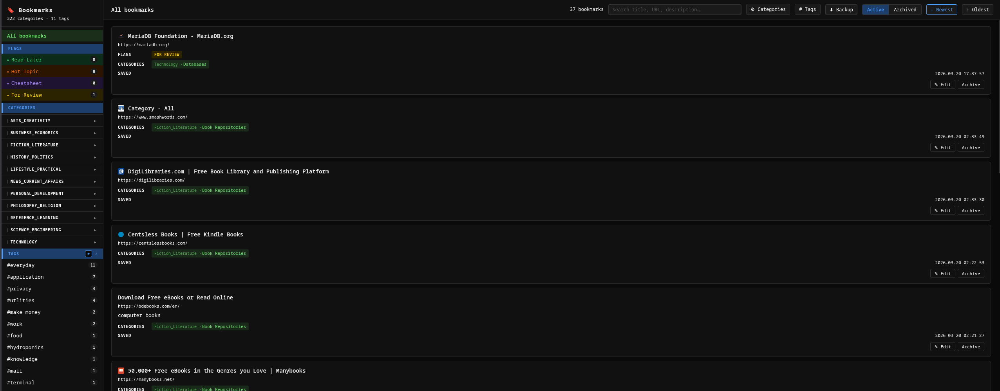
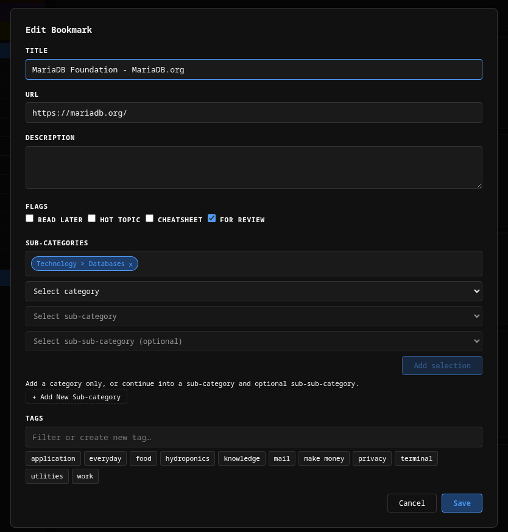

# Bookmark Manager

[](https://creativecommons.org/licenses/by-nc-sa/4.0/)
[](https://bun.sh)
[](https://elysiajs.com)
[](https://mariadb.org)
[](https://orm.drizzle.team)
[](https://podman.io)
[](https://developer.chrome.com/docs/extensions/mv3/)
[](http://localhost:11650/docs)

A self-hosted bookmark manager: a Chrome MV3 extension captures bookmarks and sends them to a local Bun/Elysia API backed by MariaDB. Everything runs on a single machine via rootless Podman + systemd (Quadlet).

---

## Table of Contents

- [README Links](#readme-links)
- [Screenshots](#screenshots)
- [Features](#features)
- [Stack](#stack)
- [Architecture](#architecture)
- [Quick Start](#quick-start)
- [Auth and Security Model](#auth-and-security-model)
- [Web UIs and Service URLs](#web-uis-and-service-urls)
- [Chrome Extension](#chrome-extension)
- [API Overview](#api-overview)
- [Data Model](#data-model)
- [Scripts](#scripts)
- [Bun Scripts (in `api/`)](#bun-scripts-in-api)
- [Testing](#testing)
- [Backup and Restore](#backup-and-restore)
- [Library Import Scripts](#library-import-scripts)
- [Infrastructure](#infrastructure)
- [Repository Structure](#repository-structure)
- [Troubleshooting](#troubleshooting)
- [License](#license)

---

## README Links

- [Project Overview](./README.md)
- [API README](./api/README.md)
- [Extension README](./extension/README.md)
- [Scripts README](./scripts/README.md)
- [E2E README](./e2e/README.md)

---

# Screenshots

</br>

## Homepage
</br>


</br></br>

## Edit Modul

</br>

---

## Features

- **Quick Save** — right-click any page for instant capture with default flags
- **Full Save** — popup form with URL, title, description, sub-categories, sub-sub-categories, tags, and flags
- **3-level taxonomy** — Categories → Sub-categories → Sub-sub-categories; bookmarks can be linked at any level
- **Tags** — many-to-many with autocomplete, inline creation, and paginated search
- **Flags** — `readLater`, `hotTopic`, `cheatsheets`, `forReview`
- **Archive/restore** — nothing is hard-deleted; every record and association row can be restored
- **Duplicate URL guard** — API enforces one active bookmark per URL; the popup surfaces existing bookmarks before blocking a duplicate save
- **Built-in web UIs** — bookmark viewer, category manager, and tag manager served directly by the API
- **Swagger UI** at `/docs` — always in sync with the running code

---

[↑ Table of Contents](#table-of-contents)

## Stack

| Layer | Technology |
|---|---|
| Chrome Extension | Manifest V3, vanilla JS/HTML/CSS |
| API | Bun + Elysia + TypeScript |
| ORM | Drizzle |
| Database | MariaDB 11 |
| Infrastructure | Rootless Podman + systemd (Quadlet) |

---

[↑ Table of Contents](#table-of-contents)

## Architecture

```
[Chrome Extension MV3]
  popup/          ← full-capture form (sub-categories, sub-sub-categories, tags, flags)
  background.js   ← service worker: context menus, API calls, messaging, toast injection
  options/        ← API base URL + API token configuration
        │  Authorization: Bearer <API_TOKEN>
        ▼
[Bun/Elysia API  :11650]  ←── 127.0.0.1 only (pod network binding)
  /bookmarks, /tags, /subcategories, /subSubcategories, /categories
  /app            ← bookmark viewer UI
  /manage-categories ← category + sub-sub-category management UI
  /manage-tags    ← tag management UI
  /config         ← auth-exempt; returns apiToken for browser UIs
  /docs           ← Swagger UI
  /backup         ← authenticated DB dump download
        │
        ▼
[MariaDB 11]  (pod-internal only, never exposed to host)
        │
[phpMyAdmin :11651]  ←── 127.0.0.1 only
```

**Data flow — Full Save:**
1. Popup opens → background fetches `/subcategories` + `/tags` → form populates
2. User submits → popup sends message to background → background `POST /bookmarks` → success/error returned to popup

**Data flow — Quick Save:**
1. Right-click → "Quick Save Bookmark" → background captures active tab (url + title)
2. `POST /bookmarks` with `forReview: true` and empty sub-categories/tags → in-page toast notification

---

[↑ Table of Contents](#table-of-contents)

## Quick Start

### 1. Configure environment

```bash
cp api/.env.example api/.env
# Set DB_PASSWORD, MARIADB_PASSWORD, MARIADB_ROOT_PASSWORD, API_TOKEN, BACKUP_TOKEN
# Generate tokens: openssl rand -hex 32
nano api/.env
```

`./scripts/install.sh` splits `api/.env` into `api/.env.api`, `api/.env.db`, and `api/.env.pma` so each container only receives the variables it needs. Never commit `api/.env` or the generated split files — they contain credentials.

### 2. Install

```bash
./scripts/install.sh
```

`install.sh` will:
1. Copy `api/.env.example → api/.env` if missing (then exit so you can set passwords)
2. Generate `api/.env.api`, `api/.env.db`, `api/.env.pma` from `api/.env`
3. Pull `mariadb:11` and `phpmyadmin:5`
4. Build `localhost/bookmark-api:latest`
5. Create the DB data volume at `~/.local/share/bookmark-manager/prod-db`
6. Copy `quadlet/` unit files to `~/.config/containers/systemd/`
7. Run `systemctl --user daemon-reload && systemctl --user enable --now bookmark-pod.service`
8. Poll `GET /ready` and report success when the API is up

Re-running `install.sh` is safe — it is idempotent.

### 3. Health check

```bash
curl http://localhost:11650/health   # → {"status":"ok","check":"liveness"}
curl http://localhost:11650/ready    # → {"status":"ok","check":"readiness"}
```

`/health` verifies the HTTP process is alive. `/ready` verifies MariaDB is reachable.

### 4. Load the Chrome extension

1. Open `chrome://extensions`
2. Enable **Developer mode**
3. Click **Load unpacked** → select the `extension/` folder
4. Open the extension **Options** page and set:
   - **API Base URL** — defaults to `http://localhost:11650`
   - **API Token** — paste the value of `API_TOKEN` from `api/.env`

---

[↑ Table of Contents](#table-of-contents)

## Auth and Security Model

**All bookmark-management routes require `Authorization: Bearer <API_TOKEN>`.**

Set `API_TOKEN` in `api/.env` to a strong random value (`openssl rand -hex 32`). The default placeholder `change_me_please` is explicitly rejected by the API with `503`.

**Auth-exempt routes** (no token needed):
- `/health`, `/ready` — health probes
- `/app`, `/manage-categories`, `/manage-tags` — static UI pages
- `/config` — returns the `apiToken` value so browser UIs can bootstrap themselves on first load
- `/docs`, `/openapi.json` — Swagger

**Backup auth** — `GET /backup` uses a separate `BACKUP_TOKEN` credential, also set in `api/.env`. Both tokens must be changed from the placeholder before the API will serve them.

**Network model** — the Quadlet pod binds the API port to `127.0.0.1:11650` only. No LAN access is possible at the network level regardless of token configuration. phpMyAdmin (`11651`) is also `127.0.0.1` only.

**Extension token handling** — the token is stored in `chrome.storage.local` (never synced across devices) and sent as `Authorization: Bearer <token>` on every API call from the background service worker.

---

[↑ Table of Contents](#table-of-contents)

## Web UIs and Service URLs

| Service | URL | Auth required |
|---|---|---|
| Bookmark viewer | `http://localhost:11650/app` | No (bootstraps token from `/config`) |
| Category manager | `http://localhost:11650/manage-categories` | No (bootstraps token from `/config`) |
| Tag manager | `http://localhost:11650/manage-tags` | No (bootstraps token from `/config`) |
| Swagger UI | `http://localhost:11650/docs` | No |
| OpenAPI JSON | `http://localhost:11650/openapi.json` | No |
| API | `http://localhost:11650` | Bearer token |
| phpMyAdmin | `http://localhost:11651` | MariaDB credentials |

The browser UIs call `GET /config` on load to retrieve the API token, then attach it as a Bearer header on all subsequent API calls. This avoids baking the token into the static HTML.

---

[↑ Table of Contents](#table-of-contents)

## Chrome Extension

### Setup

1. Load unpacked from `extension/` in `chrome://extensions` (Developer mode on)
2. Open **Options** → set API Base URL + API Token
3. Settings are saved to `chrome.storage.local` (machine-local, never synced)

### Capture methods

| Method | How | Behaviour |
|---|---|---|
| **Full Save** | Click the extension icon | Opens the popup form pre-filled with current tab URL, title, and favicon |
| **Quick Save** | Right-click → "Quick Save Bookmark" | Immediately `POST /bookmarks` with `forReview: true`; shows an in-page toast on success or error |
| **Full Save via menu** | Right-click → "Open bookmark form…" | Opens the popup programmatically (fallback to a new popup window if the API is blocked) |

### Popup form

- **URL** — read-only, pre-filled from active tab
- **Title** — editable, pre-filled from active tab
- **Description** — multiline textarea
- **Sub-categories** — multi-select with category-grouped suggestions; supports selecting sub-sub-categories; removable chips; create new sub-category on the fly (name + optional description)
- **Tags** — multi-select with debounced autocomplete (250 ms), removable chips, create new tag on the fly
- **Flags** — `readLater`, `hotTopic`, `cheatsheets`, `forReview` checkboxes

### Duplicate URL handling

If the URL already has an active bookmark, the API returns `409` with a `duplicates` array. The popup surfaces the existing bookmarks so you can review them; it does not create a second active bookmark with the same URL. Archived bookmarks do not trigger the duplicate guard.

### Background service worker messages

| Message type | Action |
|---|---|
| `fetchInitialData` | Fetches active tab info + `/subcategories` + `/tags` |
| `createTag` | `POST /tags` |
| `createSubcategory` | `POST /subcategories` |
| `createSubSubcategory` | `POST /subSubcategories` |
| `createBookmark` | `POST /bookmarks` |
| `searchTags` | `GET /tags?query=...` |

### Permissions

| Permission | Purpose |
|---|---|
| `tabs` | Read active tab URL and title |
| `activeTab` | Access current tab |
| `contextMenus` | Add right-click menu items |
| `storage` | Save extension settings |
| `notifications` | Fallback notification when toast injection is not available |
| `scripting` | On-demand toast injection into the active page |
| `host_permissions` | `http://localhost:11650/*` — configurable via Options |

---

[↑ Table of Contents](#table-of-contents)

## API Overview

Interactive docs always at **`http://localhost:11650/docs`**. The spec is auto-generated from the running code and is always current.

### Authentication

Send `Authorization: Bearer <API_TOKEN>` on all management endpoints. See [Auth and Security Model](#auth-and-security-model) for exempt routes.

### Health & UI

| Method | Path | Auth | Description |
|---|---|---|---|
| `GET` | `/` | No | Redirect to `/app` |
| `GET` | `/health` | No | Liveness check (HTTP process only) |
| `GET` | `/ready` | No | Readiness check (verifies MariaDB connectivity) |
| `GET` | `/config` | No | Returns `apiToken` for browser UI bootstrap |
| `GET` | `/docs` | No | Swagger UI |
| `GET` | `/openapi.json` | No | OpenAPI spec (alias: `/docs/json`) |
| `GET` | `/app` | No | Bookmark viewer UI |
| `GET` | `/manage-categories` | No | Category + sub-sub-category management UI |
| `GET` | `/manage-tags` | No | Tag management UI |
| `GET` | `/flag-counts` | Yes | Count of active bookmarks per flag |
| `GET` | `/backup` | `BACKUP_TOKEN` | Download gzipped MariaDB dump |

### Bookmarks

| Method | Path | Description |
|---|---|---|
| `GET` | `/bookmarks` | List/filter (`?limit=&offset=&subcategoryId=&tagId=&flag=&sortBy=&archived=`) |
| `POST` | `/bookmarks` | Create bookmark |
| `PATCH` | `/bookmarks/:id` | Edit title, description, flags, tags, sub-categories, sub-sub-categories |
| `PATCH` | `/bookmarks/:id/archive` | Soft-delete (sets `archivedAt`) |
| `PATCH` | `/bookmarks/:id/restore` | Restore archived bookmark |

**`POST /bookmarks` payload:**

```json
{
  "url": "https://example.com/article",
  "title": "Great Article",
  "description": "Why this is useful…",
  "subcategoryIds": [3],
  "subSubcategoryIds": [12],
  "categoryIds": [],
  "tags": [1, 4, 7],
  "flags": { "readLater": true, "hotTopic": false, "cheatsheets": false, "forReview": false },
  "faviconUrl": "https://example.com/favicon.ico",
  "allowDuplicate": false
}
```

- `subcategoryIds` and `subSubcategoryIds` can be used independently or together
- `allowDuplicate: true` bypasses the active-URL uniqueness check
- Returns `409` with a `duplicates` array when an active bookmark has the same URL

### Tags

| Method | Path | Description |
|---|---|---|
| `GET` | `/tags` | List/search (`?query=&exact=&limit=&offset=&sort=count\|alpha&archived=`) |
| `POST` | `/tags` | Create tag |
| `PATCH` | `/tags/:id` | Rename tag |
| `PATCH` | `/tags/:id/archive` | Archive tag (blocked if active bookmarks still use it) |
| `PATCH` | `/tags/:id/restore` | Restore archived tag |

### Sub-categories

| Method | Path | Description |
|---|---|---|
| `GET` | `/subcategories` | All active sub-categories, nested by category (includes sub-sub-categories) |
| `POST` | `/subcategories` | Create sub-category (`name`, `description?`, `categoryId?`, `categoryName?`) |
| `PATCH` | `/subcategories/:id` | Rename sub-category and/or update description |
| `PATCH` | `/subcategories/:id/archive` | Archive (blocked if active bookmarks still use it) |
| `PATCH` | `/subcategories/:id/restore` | Restore archived sub-category |

### Sub-sub-categories

Third-level taxonomy items nested inside a sub-category. Bookmarks can be linked to sub-categories, sub-sub-categories, or both.

| Method | Path | Description |
|---|---|---|
| `GET` | `/subSubcategories` | All active sub-sub-categories, grouped by sub-category |
| `POST` | `/subSubcategories` | Create sub-sub-category (`name`, `description?`, `subcategoryId`) |
| `PATCH` | `/subSubcategories/:id` | Rename sub-sub-category and/or update description |
| `PATCH` | `/subSubcategories/:id/archive` | Archive (blocked if active bookmarks still use it) |
| `PATCH` | `/subSubcategories/:id/restore` | Restore archived sub-sub-category |

### Categories

| Method | Path | Description |
|---|---|---|
| `GET` | `/categories` | Management view: categories with nested sub-categories + sub-sub-categories + `archivedAt` |
| `POST` | `/categories` | Create category (`name`, `description?`) |
| `PATCH` | `/categories/:id` | Rename category and/or update description |
| `PATCH` | `/categories/:id/archive` | Archive (blocked if any active bookmarks exist in the whole branch) |
| `PATCH` | `/categories/:id/restore` | Restore archived category (sub-categories restored separately) |

---

[↑ Table of Contents](#table-of-contents)

## Data Model

All tables carry `archived_at DATETIME NULL`. `NULL` = active. "Deleting" sets `archived_at = NOW()`. Nothing is hard-deleted.

| Table | Purpose |
|---|---|
| `bookmarks` | Core bookmark store |
| `categories` | Top-level taxonomy; each category has an optional `description` |
| `subcategories` | Second-level taxonomy, grouped under a category; optional `description` |
| `sub_subcategories` | Third-level taxonomy, nested under a sub-category; optional `description` |
| `tags` | Flexible labels; many-to-many with bookmarks |
| `bookmark_tags` | Junction: bookmarks ↔ tags (archive/restore semantics) |
| `bookmark_subcategories` | Junction: bookmarks ↔ sub-categories (archive/restore semantics) |
| `bookmark_sub_subcategories` | Junction: bookmarks ↔ sub-sub-categories (archive/restore semantics) |

**Uniqueness among active rows** — `tags`, `subcategories`, and `sub_subcategories` use a generated column (`name_active`) that is `NULL` when the row is archived, with a unique index on that column. This lets archived rows share names with active rows without constraint violations.

**Replacing associations** — when you edit a bookmark's tags or sub-categories, removed junction rows are archived (not deleted) and reactivated if the same link is added again later.

**Archive safety checks** — archiving a tag, sub-category, sub-sub-category, or category is blocked if any active (non-archived) bookmarks are still linked to it. The error response reports the exact count so you know what to reassign first.

---

[↑ Table of Contents](#table-of-contents)

## Scripts

All scripts live in `scripts/` and are run from the **repo root**. Every script uses `set -euo pipefail` with colour-coded output (cyan = info, green = success, yellow = warning, red = error).

| Script | Args | Description |
|---|---|---|
| `install.sh` | — | Full first-time install: build image, deploy Quadlet, start pod, wait for readiness |
| `uninstall.sh` | — | Stop services, remove Quadlet files, interactively confirm before removing image or data |
| `rebuild.sh` | — | Rebuild API image and restart `bookmark-api.service`; polls `/ready` until ready |
| `start.sh` | — | Start the pod (all three containers) |
| `stop.sh` | — | Stop the pod gracefully |
| `restart.sh` | `[api\|db\|pma]` | Restart one service or the whole pod |
| `logs.sh` | `[api\|db\|pma\|all]` | Tail journalctl logs; defaults to `api` |
| `status.sh` | — | Show `systemctl --user status` for all services |
| `dev.sh` | — | Run API locally via `bun run dev` (watch mode, no container) |
| `backup.sh` | — | Dump MariaDB to `backups/bookmark_YYYY-MM-DD_HHMMSS.sql.gz` |
| `verify-backup.sh` | `--source script\|api` / `--file <path>` | Validate and test-restore a backup dump |
| `test-integration.sh` | — | Run the Bun integration suite against the running pod DB |
| `test-e2e.sh` | `[playwright args]` | Run the Playwright E2E suite (API + Web UI + extension) |
| `import-library-categories.sh` | `[--dry-run\|--apply] [--keep-stage-db]` | Bulk-import library categories/sub-categories from a seed SQL file |
| `import-library-sub-subcategories.sh` | `[--dry-run\|--apply]` | Bulk-import level-3 sub-sub-categories from the same seed SQL file |

See [`scripts/README.md`](scripts/README.md) for full per-script documentation.

---

[↑ Table of Contents](#table-of-contents)

## Bun Scripts (in `api/`)

Run these from the `api/` directory.

| Command | Description |
|---|---|
| `bun run dev` | Watch mode (`bun --watch src/server.ts`) |
| `bun run start` | Production start |
| `bun run test:integration` | Run integration suite when MariaDB is reachable from your shell |
| `bun run db:generate` | Generate a new Drizzle migration from schema changes |
| `bun run db:migrate` | Apply pending Drizzle migrations |
| `bun run db:studio` | Open Drizzle Studio (visual DB browser) |
| `bun run smoke` | Smoke-test real `/health` + `/ready` behavior |
| `bun run e2e` | Run the full Playwright E2E suite |
| `bun run e2e:api` | API smoke tests only |
| `bun run e2e:headed` | E2E suite in headed (visible) browser mode |
| `bun run e2e:report` | Open the last Playwright HTML report |

**Schema changes workflow:**

```bash
# 1. Edit api/src/db/schema.ts
# 2. Generate the migration
cd api && bun run db:generate
# 3. Rebuild and restart (migrations run automatically on container start)
cd .. && ./scripts/rebuild.sh
```

---

[↑ Table of Contents](#table-of-contents)

## Testing

### Integration tests (Bun)

Fast tests that run inside a temporary container joined to the running pod, exercising MariaDB directly:

```bash
./scripts/test-integration.sh
```

### E2E tests (Playwright)

Full end-to-end suite covering the REST API, Web UI, Chrome extension options page, and popup. Requires the pod to be running.

```bash
# Full suite
API_TOKEN=<your-token> ./scripts/test-e2e.sh

# API smoke only (fastest — no extension required)
API_TOKEN=<your-token> ./scripts/test-e2e.sh --project=api-smoke

# Headed mode (watch the browser)
API_TOKEN=<your-token> ./scripts/test-e2e.sh --headed
```

If `API_TOKEN` is not set, all token-gated tests are automatically **skipped** (not failed). The health and auth-guard tests always run.

See [`e2e/README.md`](e2e/README.md) for full E2E documentation.

---

[↑ Table of Contents](#table-of-contents)

## Backup and Restore

### Shell script (recommended for cron/automation)

```bash
./scripts/backup.sh
# → backups/bookmark_YYYY-MM-DD_HHMMSS.sql.gz
```

Runs `mariadb-dump --single-transaction --routines --triggers` inside the `bookmark-db` container and pipes through `gzip -9`. The `backups/` directory is gitignored.

### API endpoint

```bash
curl -H "Authorization: Bearer <BACKUP_TOKEN>" \
     http://localhost:11650/backup \
     -o backup.sql.gz
```

Returns a `bookmark_YYYY-MM-DD_HHMMSS.sql.gz` download. The **⬇ Backup** button in the `/app` topbar calls this endpoint directly. Returns `503` if `BACKUP_TOKEN` is still the default placeholder.

### Restore

```bash
gunzip -c backups/bookmark_YYYY-MM-DD_HHMMSS.sql.gz \
  | podman exec -i bookmark-db mariadb -u bookmark -p bookmarks
```

### Verify a backup

```bash
./scripts/verify-backup.sh --source script   # test the backup.sh path
./scripts/verify-backup.sh --source api      # test the GET /backup path
./scripts/verify-backup.sh --file backups/bookmark_YYYY-MM-DD_HHMMSS.sql.gz
```

Validates the `.sql.gz` archive with `gzip -t`, restores into a temporary database, and checks the core tables exist. The integration test suite also covers both backup paths automatically.

---

[↑ Table of Contents](#table-of-contents)

## Library Import Scripts

Two scripts bulk-import a 3-level category taxonomy from a seed SQL file at `backups/library_categories_schema_seed.sql`.

Both scripts default to `--dry-run` and must be given `--apply` to make changes. They create a temporary staging database, run preflight validation, and clean it up on exit.

### Import categories and sub-categories (levels 1 and 2)

```bash
# Dry run (default) — validates and reports counts; no data changed
./scripts/import-library-categories.sh

# Apply — inserts/updates categories and sub-categories in a single transaction
./scripts/import-library-categories.sh --apply

# Keep the staging database for post-import inspection
./scripts/import-library-categories.sh --apply --keep-stage-db
```

**Preflight checks (any failure aborts the import):**
- No duplicate category names in seed
- No duplicate sub-category names within the same parent in seed
- No duplicate active categories in the live database
- No duplicate active sub-categories within the same parent in the live database
- All level-2 rows have a valid level-1 parent in the seed

**What `--apply` does (wrapped in a single transaction):**
- Updates `description` and `order` for categories/sub-categories that already exist (matched by name)
- Inserts new categories and sub-categories that do not yet exist
- Level-3 rows from the seed are silently skipped (handled by the sub-subcategory script)

### Import sub-sub-categories (level 3)

```bash
./scripts/import-library-sub-subcategories.sh           # dry run
./scripts/import-library-sub-subcategories.sh --apply   # apply
```

Reads level-3 entries from the same seed file and maps them to live sub-categories created by the categories script. Reports `seed_level3_rows`, `mapped_level3_rows`, and `missing_parent_rows` before applying.

### Prerequisites for both scripts

- `bookmark-db` container must be running (`./scripts/start.sh`)
- `api/.env` must contain `DB_USER`, `DB_PASSWORD`, `DB_NAME`, and `MARIADB_ROOT_PASSWORD`
- Seed file must exist at `backups/library_categories_schema_seed.sql`
- Run the categories script first, then the sub-subcategories script

---

[↑ Table of Contents](#table-of-contents)

## Infrastructure

### Pod and containers

| Unit file | Image | Port | Access |
|---|---|---|---|
| `bookmark.pod` | — | — | Pod definition |
| `bookmark-api.container` | `localhost/bookmark-api:latest` | `127.0.0.1:11650` | Localhost only |
| `bookmark-db.container` | `docker.io/mariadb:11` | *(pod-internal)* | Not exposed to host |
| `bookmark-pma.container` | `docker.io/phpmyadmin:5` | `127.0.0.1:11651` | Localhost only |

All containers share the pod network. MariaDB is reachable within the pod at `127.0.0.1:3306`.

### Quadlet unit files

Canonical copies live in `quadlet/` (version-controlled). `scripts/install.sh` copies them to `~/.config/containers/systemd/`.

### DB data volume

```
~/.local/share/bookmark-manager/prod-db
```

Created by `install.sh`. Never removed automatically — `uninstall.sh` asks for explicit confirmation before deleting it.

### Boot persistence

```bash
loginctl enable-linger $USER
```

Run once per user to enable auto-start without an interactive session.

### Environment files

| File | Purpose | Committed |
|---|---|---|
| `api/.env.example` | Template — copy to `api/.env` | Yes |
| `api/.env` | Live credentials (source of truth) | **No** |
| `api/.env.api` | Split file for API container | **No** |
| `api/.env.db` | Split file for MariaDB container | **No** |
| `api/.env.pma` | Split file for phpMyAdmin container | **No** |

### Environment variables reference

| Variable | Default | Description |
|---|---|---|
| `API_PORT` | `11650` | HTTP port |
| `LOG_LEVEL` | `info` | Elysia log level |
| `DB_HOST` | `127.0.0.1` | MariaDB host (must be `127.0.0.1` within the pod) |
| `DB_PORT` | `3306` | MariaDB port |
| `DB_USER` | `bookmark` | DB username |
| `DB_PASSWORD` | — | DB password |
| `DB_NAME` | `bookmarks` | DB name |
| `API_TOKEN` | `change_me_please` | Bearer token for all management routes; placeholder is rejected with `503` |
| `BACKUP_TOKEN` | `change_me_please` | Bearer token for `GET /backup`; placeholder is rejected with `503` |
| `MARIADB_DATABASE` | — | MariaDB container init |
| `MARIADB_USER` | — | MariaDB container init |
| `MARIADB_PASSWORD` | — | MariaDB container init |
| `MARIADB_ROOT_PASSWORD` | — | MariaDB container init |
| `PMA_HOST` | `127.0.0.1` | phpMyAdmin DB host |
| `PMA_PORT` | `3306` | phpMyAdmin DB port |
| `PMA_ABSOLUTE_URI` | `http://localhost:11651/` | phpMyAdmin canonical URL |

### API container hardening

- Production dependencies only — `drizzle-kit` is not in the runtime image
- Startup migrations run via `api/src/db/migrate.ts` (waits for MariaDB, then applies SQL migrations before the server starts)
- Runs as a non-root user with a read-only root filesystem, `tmpfs` at `/tmp`, and `NoNewPrivileges=true`
- `mariadb-client` is included because the authenticated `/backup` endpoint streams `mariadb-dump`

---

[↑ Table of Contents](#table-of-contents)

## Repository Structure

```
bookmarkManager/
├── api/                          # Bun/Elysia API
│   ├── src/
│   │   ├── server.ts             # Elysia app + route registration
│   │   ├── routes/               # Route handlers (bookmarks, tags, categories, etc.)
│   │   ├── db/
│   │   │   ├── schema.ts         # Drizzle table definitions
│   │   │   ├── client.ts         # Drizzle + mysql2 pool
│   │   │   ├── migrate.ts        # Startup migration runner
│   │   │   └── migrations/       # Drizzle-generated SQL
│   │   ├── ui/
│   │   │   ├── app.html          # Bookmark viewer (served at /app)
│   │   │   ├── categories.html   # Category manager (served at /manage-categories)
│   │   │   └── tags.html         # Tag manager (served at /manage-tags)
│   │   └── smoke/                # No-DB health smoke test
│   ├── Dockerfile
│   ├── healthcheck.mjs           # Container healthcheck (reads $API_PORT)
│   ├── drizzle.config.ts
│   ├── package.json
│   ├── .env.example              # Template — copy to .env
│   └── .env                      # Live credentials (gitignored)
├── extension/                    # Chrome MV3 extension (vanilla JS)
│   ├── manifest.json
│   ├── popup/                    # Main capture form
│   ├── background/               # Service worker
│   ├── options/                  # Settings page
│   ├── content/                  # Toast injection script
│   ├── lib/                      # storage.js, validate.js
│   └── assets/icons/
├── e2e/                          # Playwright E2E test suite
│   ├── playwright.config.ts
│   ├── global-setup.ts
│   ├── fixtures.ts
│   └── tests/
│       ├── api.spec.ts           # REST API smoke tests
│       ├── webapp.spec.ts        # Web UI tests
│       ├── options.spec.ts       # Extension options tests
│       └── popup.spec.ts         # Extension popup tests
├── quadlet/                      # Quadlet unit files (version-controlled)
│   ├── bookmark.pod
│   ├── bookmark-api.container
│   ├── bookmark-db.container
│   └── bookmark-pma.container
├── scripts/                      # Lifecycle and utility scripts
│   ├── install.sh
│   ├── uninstall.sh
│   ├── rebuild.sh
│   ├── start.sh / stop.sh / restart.sh
│   ├── logs.sh / status.sh
│   ├── dev.sh
│   ├── backup.sh
│   ├── verify-backup.sh
│   ├── test-integration.sh
│   ├── test-e2e.sh
│   ├── import-library-categories.sh
│   └── import-library-sub-subcategories.sh
├── backups/                      # DB dump files (gitignored)
├── PLAN.md                       # Deprecated — see this file
└── README.md                     # This file (canonical project documentation)
```

---

[↑ Table of Contents](#table-of-contents)

## Troubleshooting

| Symptom | Fix |
|---|---|
| Port `11650` or `11651` busy | Edit `quadlet/bookmark.pod`, change `PublishPort`, re-run `./scripts/install.sh` |
| API can't reach DB | Check `api/.env` — `DB_PASSWORD` must match `MARIADB_PASSWORD`; `DB_HOST` must be `127.0.0.1`; re-run `./scripts/install.sh` to regenerate split env files |
| Extension gets `401` errors | Open Options → paste the value of `API_TOKEN` from `api/.env` into the **API Token** field |
| API returns `503` on all requests | `API_TOKEN` is unset or still `change_me_please` — set a strong random value in `api/.env` and re-run `./scripts/install.sh` |
| `/backup` returns `503` | `BACKUP_TOKEN` is unset or still `change_me_please` — same fix as above |
| Extension can't reach API | Verify base URL in Options; check `host_permissions` in `extension/manifest.json` |
| Services not starting at boot | Run `loginctl enable-linger $USER` |
| Import script aborts on preflight | Fix the reported duplicate or missing-parent condition in the seed file or live DB before re-running |
| `bun run db:generate` produces no output | Schema in `api/src/db/schema.ts` matches the last migration — no change needed |

---

[↑ Table of Contents](#table-of-contents)

## License

Creative Commons Attribution-NonCommercial-ShareAlike 4.0 International (CC BY-NC-SA 4.0)

https://creativecommons.org/licenses/by-nc-sa/4.0/

[↑ Table of Contents](#table-of-contents)

---

© 2026 Jaco Steyn — Licensed under CC BY-NC-SA 4.0
