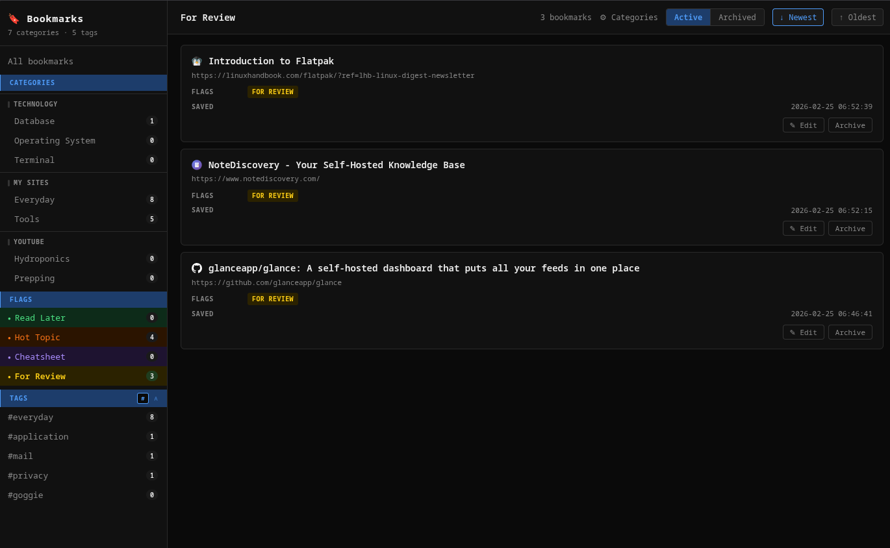
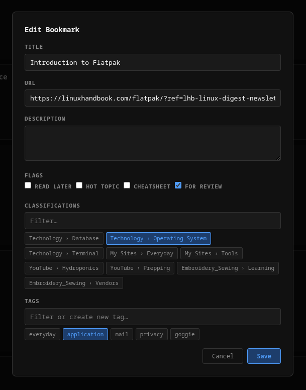

# Bookmark Manager

[](https://creativecommons.org/licenses/by-nc-sa/4.0/)
[](https://bun.sh)
[](https://elysiajs.com)
[](https://mariadb.org)
[](https://podman.io)
[](https://developer.chrome.com/docs/extensions/mv3/)
[](http://localhost:11650/docs)

A Chrome extension (MV3) that captures bookmarks and sends them to a local Bun/Elysia API backed by MariaDB.

Everything is implemented in JavaScript (no TypeScript) for the extension; the API uses TypeScript with Bun.

---

## Table of Contents

- [Stack](#stack)
- [Quick Start](#quick-start)
  - [1. Configure environment](#1-configure-environment)
  - [2. Install](#2-install-build-image--deploy-quadlet--start-pod)
  - [3. Health check](#3-health-check)
  - [4. Load the Chrome extension](#4-load-the-chrome-extension)
- [Scripts](#scripts)
- [Repository Structure](#repository-structure)
- [API Overview](#api-overview)
  - [Health & UI](#health--ui)
  - [Bookmarks](#bookmarks)
  - [Tags](#tags)
  - [Classifications](#classifications)
  - [Classification Groups](#classification-groups)
- [Chrome Extension](#chrome-extension)
- [Backup](#backup)
- [Troubleshooting](#troubleshooting)
- [License](#license)

---

</br></br>

</br></br>


---

## Stack

| Layer | Technology |
|---|---|
| Chrome Extension | Manifest V3, vanilla JS/HTML/CSS |
| API | Bun + Elysia + TypeScript |
| ORM | Drizzle |
| Database | MariaDB 11 |
| Infrastructure | Rootless Podman + systemd (Quadlet) |

---

[↑ Table of Contents](#table-of-contents)

## Quick Start

### 1. Configure environment

```bash
cp api/.env.example api/.env
# Edit api/.env — set DB_PASSWORD, MARIADB_PASSWORD, MARIADB_ROOT_PASSWORD,
#                  API_TOKEN, and BACKUP_TOKEN to strong random values
# Generate tokens: openssl rand -hex 32
nano api/.env
```

`./scripts/install.sh` splits `api/.env` into `api/.env.api`, `api/.env.db`, and `api/.env.pma` so each service only receives the variables it needs.

### 2. Install (build image + deploy Quadlet + start pod)

```bash
./scripts/install.sh
```

`install.sh` will:
- Copy `api/.env.example → api/.env` if missing (then exit so you can set passwords)
- Generate `api/.env.api`, `api/.env.db`, and `api/.env.pma` from `api/.env`
- Pull `mariadb:11` and `phpmyadmin:5`
- Build `localhost/bookmark-api:latest`
- Copy `quadlet/` unit files into `~/.config/containers/systemd/`
- Run `systemctl --user daemon-reload` and start the pod
- Wait for `GET /ready` before reporting success

### 3. Health check

```bash
curl http://localhost:11650/health
# → {"status":"ok","check":"liveness"}

curl http://localhost:11650/ready
# → {"status":"ok","check":"readiness"}
```

`/health` shows that the HTTP process is alive. `/ready` shows that the API can reach MariaDB and is ready for DB-backed requests.

| Service | URL |
|---|---|
| API | `http://localhost:11650` |
| Swagger UI | `http://localhost:11650/docs` |
| OpenAPI JSON | `http://localhost:11650/openapi.json` |
| Bookmark viewer | `http://localhost:11650/app` |
| Category manager | `http://localhost:11650/categories` |
| phpMyAdmin | `http://localhost:11651` |

### 4. Load the Chrome extension

1. Open `chrome://extensions`
2. Enable **Developer mode**
3. Click **Load unpacked** → select the `extension/` folder
4. Open the extension **Options** page and set:
   - **API Base URL** — defaults to `http://localhost:11650`; change if you use a different port
   - **API Token** — paste the same value you set for `API_TOKEN` in `api/.env`

---

[↑ Table of Contents](#table-of-contents)

## Scripts

All scripts live in `scripts/` and are run from the repo root.

| Script | Description |
|---|---|
| `./scripts/install.sh` | Full install: build image, deploy Quadlet files, start pod, wait for readiness |
| `./scripts/uninstall.sh` | Stop services, remove Quadlet files, optionally remove image + data |
| `./scripts/rebuild.sh` | Rebuild API image and restart `bookmark-api.service` |
| `./scripts/start.sh` | Start the pod (all services) |
| `./scripts/stop.sh` | Stop the pod (all services) |
| `./scripts/restart.sh [api\|db\|pma]` | Restart one service or the whole pod |
| `./scripts/logs.sh [api\|db\|pma\|all]` | Tail logs — defaults to `api` |
| `./scripts/status.sh` | Show `systemctl --user status` for all services |
| `./scripts/dev.sh` | Run API locally via `bun run dev` (no container) |
| `./scripts/backup.sh` | Dump MariaDB to `backups/bookmark_YYYY-MM-DD_HHMMSS.sql.gz` |
| `./scripts/test-integration.sh` | Run the Bun integration suite against the running pod DB |

See [`scripts/README.md`](scripts/README.md) for full per-script documentation.

---

[↑ Table of Contents](#table-of-contents)

## Repository Structure

```
bookmarkManager/
├── api/                    # Bun/Elysia API
│   ├── src/
│   │   ├── server.ts       # Elysia app + routes
│   │   ├── db/             # Drizzle schema, client, migrations
│   │   ├── ui/             # Served HTML pages (/app, /categories)
│   │   └── smoke/          # No-DB health smoke test
│   ├── Dockerfile
│   ├── drizzle.config.ts
│   ├── package.json
│   ├── .env                # Live credentials (gitignored)
│   └── .env.example        # Template — copy to .env
├── extension/              # Chrome MV3 extension (vanilla JS)
│   ├── manifest.json
│   ├── popup/
│   ├── background/
│   ├── options/
│   ├── lib/
│   └── assets/
├── quadlet/                # Canonical Quadlet unit files (version-controlled)
│   ├── bookmark.pod
│   ├── bookmark-api.container
│   ├── bookmark-db.container
│   └── bookmark-pma.container
├── scripts/                # Lifecycle scripts
│   ├── install.sh
│   ├── uninstall.sh
│   ├── rebuild.sh
│   ├── start.sh
│   ├── stop.sh
│   ├── restart.sh
│   ├── logs.sh
│   ├── status.sh
│   ├── dev.sh
│   └── backup.sh           # DB dump → backups/
├── backups/                # Dump files (gitignored)
├── PLAN.md                 # Full project reference
└── README.md               # This file
```

---

[↑ Table of Contents](#table-of-contents)

## API Overview

Interactive docs always available at **`http://localhost:11650/docs`**.

### Health & UI

| Method | Path | Description |
|---|---|---|
| `GET` | `/` | Redirect to `/app` |
| `GET` | `/health` | Liveness check for the HTTP process |
| `GET` | `/ready` | Readiness check that verifies MariaDB connectivity |
| `GET` | `/docs` | Swagger UI |
| `GET` | `/openapi.json` | OpenAPI spec |
| `GET` | `/app` | Bookmark viewer UI |
| `GET` | `/categories` | Category management UI |
| `GET` | `/flag-counts` | Count of active bookmarks per flag |
| `GET` | `/backup` | Download a gzipped MariaDB dump (requires `Authorization: Bearer` header) |

[↑ Table of Contents](#table-of-contents)

### Bookmarks

| Method | Path | Description |
|---|---|---|
| `GET` | `/bookmarks` | List/filter bookmarks (`?limit=&offset=&classificationId=&tagId=&flag=&sortBy=&archived=`) |
| `POST` | `/bookmarks` | Create bookmark |
| `PATCH` | `/bookmarks/:id` | Edit title, description, flags, tags, classifications |
| `PATCH` | `/bookmarks/:id/archive` | Soft-delete (sets `archivedAt`) |
| `PATCH` | `/bookmarks/:id/restore` | Restore archived bookmark |

[↑ Table of Contents](#table-of-contents)

### Tags

| Method | Path | Description |
|---|---|---|
| `GET` | `/tags` | List/search tags (`?query=&limit=&offset=&sort=`) |
| `POST` | `/tags` | Create tag |
| `PATCH` | `/tags/:id/archive` | Archive tag |
| `PATCH` | `/tags/:id/restore` | Restore archived tag |

[↑ Table of Contents](#table-of-contents)

### Classifications

| Method | Path | Description |
|---|---|---|
| `GET` | `/classifications` | All active classifications, nested by group |
| `POST` | `/classifications` | Create classification (optionally with new group) |
| `PATCH` | `/classifications/:id` | Rename classification |
| `PATCH` | `/classifications/:id/reorder` | Set display order |
| `PATCH` | `/classifications/:id/archive` | Archive classification |
| `PATCH` | `/classifications/:id/restore` | Restore archived classification |

[↑ Table of Contents](#table-of-contents)

### Classification Groups

| Method | Path | Description |
|---|---|---|
| `GET` | `/classifications/groups` | List groups with nested classifications (management view) |
| `POST` | `/classifications/groups` | Create group |
| `PATCH` | `/classifications/groups/:id` | Rename group |
| `PATCH` | `/classifications/groups/:id/reorder` | Set display order |
| `PATCH` | `/classifications/groups/:id/archive` | Archive group |
| `PATCH` | `/classifications/groups/:id/restore` | Restore archived group |

**Data lifecycle:** nothing is hard-deleted. Entity records and bookmark association rows are archived via `archivedAt`, and replacing bookmark tags/classifications archives removed links instead of deleting them.

**Duplicate URL detection:** `POST /bookmarks` returns `409` with existing bookmark metadata when an active bookmark already has that URL. This is enforced by the database, so concurrent creates cannot produce duplicate active URLs, while archived bookmarks can still share the same URL.

---

[↑ Table of Contents](#table-of-contents)

## Chrome Extension

- Click the action icon for the popup (full save with form)
- Right-click a page for context menus: **Quick Save** / **Full Save**

See [`extension/README.md`](extension/README.md) for full extension documentation.
See [`api/README.md`](api/README.md) for full API documentation.

---

[↑ Table of Contents](#table-of-contents)

## Backup

Two backup methods are available: a **shell script** (recommended for cron/automation) and an in-browser **API endpoint**.

### Shell script

```bash
./scripts/backup.sh
```

- Runs `mariadb-dump` inside the `bookmark-db` container via `podman exec`
- Pipes output through `gzip -9`
- Saves to `backups/bookmark_YYYY-MM-DD_HHMMSS.sql.gz` (directory is gitignored)

See [`scripts/README.md`](scripts/README.md) for full options and a restore command.

### API endpoint

```bash
curl -H "Authorization: Bearer <BACKUP_TOKEN>" \
     http://localhost:11650/backup \
     -o backup.sql.gz
```

- Returns a `bookmark_YYYY-MM-DD_HHMMSS.sql.gz` download
- Requires `BACKUP_TOKEN` to be set in `api/.env` (a strong random value — the default `change_me_please` is refused with `503`)
- Returns `401` on missing or invalid `Authorization` header, `503` if token is unconfigured
- Note: `/backup` uses its own `BACKUP_TOKEN`, separate from the general-purpose `API_TOKEN`
- The **⬇ Backup** button in the `http://localhost:11650/app` topbar calls this endpoint — it will prompt for your token and send it securely in the request header

### Restore

```bash
gunzip -c backups/bookmark_YYYY-MM-DD_HHMMSS.sql.gz \
  | podman exec -i bookmark-db mariadb -u bookmarks -p bookmarks
```

### Verify backup + restore

```bash
./scripts/verify-backup.sh --source script
./scripts/verify-backup.sh --source api
./scripts/verify-backup.sh --file backups/bookmark_YYYY-MM-DD_HHMMSS.sql.gz
```

- Validates the `.sql.gz` file with `gzip -t`
- Restores the dump into a temporary MariaDB database and checks the core tables exist
- `./scripts/test-integration.sh` now covers the API backup route and the script restore workflow automatically

---

[↑ Table of Contents](#table-of-contents)

## Troubleshooting

| Symptom | Fix |
|---|---|
| Port 11650 or 11651 busy | Edit `quadlet/bookmark.pod`, change `PublishPort`, re-run `./scripts/install.sh` |
| API can't reach DB | Check `api/.env` — `DB_PASSWORD` must match `MARIADB_PASSWORD`; `DB_HOST` must be `127.0.0.1`; then re-run `./scripts/install.sh` to regenerate split env files |
| Extension gets `401` errors | Open the extension **Options** page and paste the value of `API_TOKEN` from `api/.env` into the **API Token** field |
| API returns `503` on all requests | `API_TOKEN` is unset or still `change_me_please` — set a strong random value in `api/.env` and re-run `./scripts/install.sh` |
| Extension can't reach API | Verify base URL in Options; check `host_permissions` in `extension/manifest.json` |
| Services not starting at boot | Run `loginctl enable-linger $USER` to enable linger for your user |

---

[↑ Table of Contents](#table-of-contents)

## License

This project is licensed under the
Creative Commons Attribution-NonCommercial-ShareAlike 4.0 International (CC BY-NC-SA 4.0).

https://creativecommons.org/licenses/by-nc-sa/4.0/

[↑ Table of Contents](#table-of-contents)

---

© 2026 Jaco Steyn — Licensed under CC BY-NC-SA 4.0
